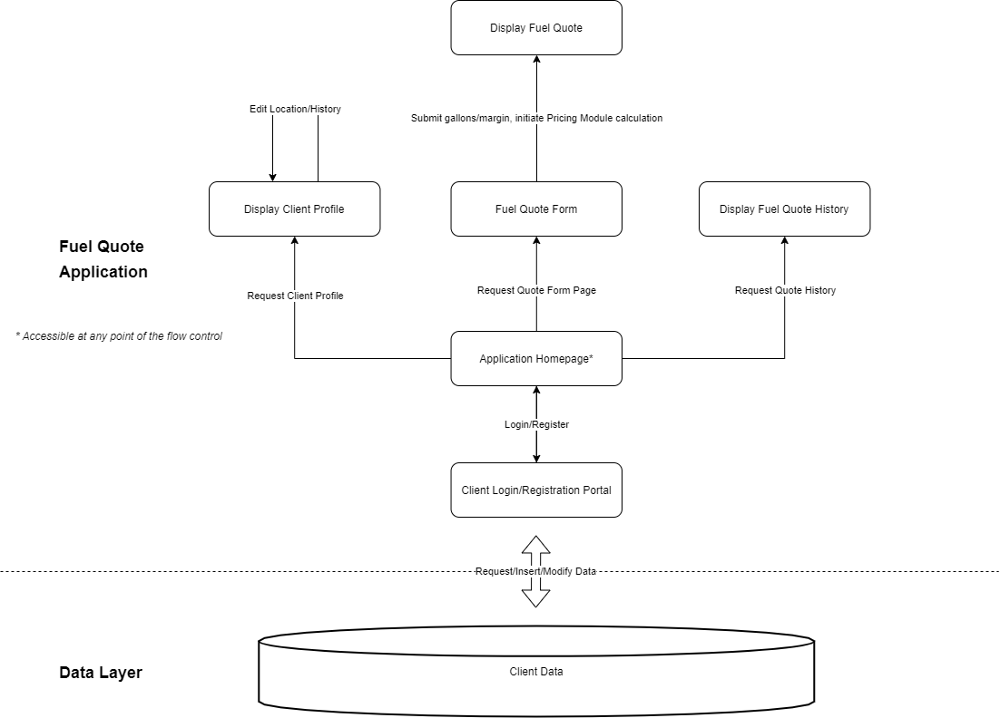

### 1. *Discuss your initial thoughts in details on how you will design this application?*

We will design the application by implementing each one required component at a time. The first two parts are login and client registration. If the client is a first-time user, then the client registration will be implemented to help the client to get their new username and password. Otherwise, the client who is a returning user will login with their username and password. The third part is client profile management. After the client registers, they will have to login for the first time with their username and password to complete their new profile. Each profile will consist of name, location, birth date, and social security number. The fourth part is fuel quote form with pricing module. The client must put in the following required information: client location (in-state or out-of-state), client history (existing customer with previous purchase or new), gallons requested, and company profit margin (%). Once the client enters all required information, the pricing module calculates the rate and provides total cost. The fifth and final part is the fuel quote history. The fuel quote history will show the fuel rate so far for each client per day. But, the required components do not have to be done in order as we will work on which component is most important to implement for the application. We will also share ideas on how we implement the components.

### 2. *Discuss what development methodology you will use and why?*  

We have decided to employ **incremental development** for our project development methodology. The project is already split into sequential assignments/phases, and each assignment requires several components that build off of each other, so incremental development fits easily into the overall project layout. In particular, incremental development provides concrete markers of progress with at least some guaranteed functionality at each iteration. Also, because the project is relatively small-scale with pre-established requirements, the downsides of incremental development (poorly defined structure, not ideal for large systems) are essentially mitigated.

### 3. *Provide high level design / architecture of your solution that you are proposing*

The following diagram outlines the high level design of our application. It specifies the flow-of-control of our web application upon login/registration, detailing what functionality a client can expect from each type of action requested from the application.

### 4. *Workload distribution:*

* Travis: Answered Question 2 (Development methodology)
* Khang: Answered Question 1 (Initial thoughts)
* Sammy: Answered Question 3, created diagram (Software Architecture and Diagram)