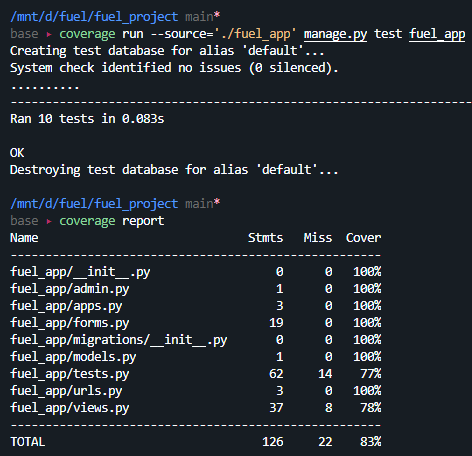

### *1. Provide link to Github repository*

https://github.com/sammito1/fuel

### *2. List what backend technologies you are using and why?*

We are using Django as our backend web framework due to its prevalence in modern web applications like Instagram, Quora, NASA, and many more, along with its relative ease of setup/use and thorough official documentation. Importantly, we leveraged Django's unified and straightforward approach to implementing complex components like forms in a reliable manner, which would otherwise require complex front and back-end validations to be manually implemented. Additionally, we took advantage of Django's support for HTML templating, which enables one to write HTML code that can be inherited by child templates from parent templates, thus maximizing code reusability. Lastly, we chose Django due to our shared familiarity with Python and its libraries like `coverage.py`, which we used to generate our code coverage report for question 3.

### *3. Provide code coverage report*

We reached 83% code coverage in our application according to the `coverage.py` module (https://coverage.readthedocs.io/en/coverage-5.5/)

### *4. List who did what within the group.*

* Travis:
	 * Designed and implemented view for profile module
	 * Designed and implemented automated unit tests for profile module
* Khang:
	 * Designed and implemented view for fuel quote module
	 * Designed and implemented automated unit tests for fuel quote module
* Sammy:
	 * Set up initial Django application
	 * Designed and implemented view for login/registration module
	 * Designed and implemented automated unit tests for login/registration module
