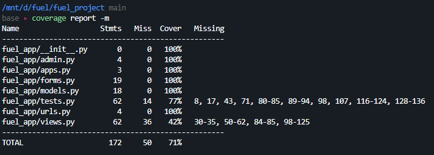

### *1. Provide link to Github repository*

https://github.com/sammito1/fuel

### *2. Provide SQL statements to create a database*

```
create table "UserCredentials"
(
	user_id serial
		constraint usercredentials_pk
			primary key,
	hashed_password varchar
);

create table "ClientInformation"
(
	client_id integer not null
		constraint clientinformation_pk
			primary key,
	user_id integer
		constraint user_id_fk
			references "UserCredentials",
	name text,
	address text,
	city text,
	state text,
	email text,
	zipcode varchar(5)
);

create table "FuelQuote"
(
	quote_id int
		constraint fuelquote_pk
			primary key,
	user_id int
		constraint user_id_fk
			references "UserCredentials",
	price float,
	date date,
	address text,
	gallons int,
	total_price float
);
```

### *3. Provide code coverage report*



We noted that there was an issue with the report generated by the Python coverage library (or with the way we ran it), as it reported that many lines in `views.py` (specifically, 98-125) are not covered whatsoever by tests, but we have implemented many tests for all implemented modules in `views.py`. Thus, it output 71% coverage after running 10 tests, even though we have over 15 tests in `tests.py` that seem to cover lines 98-125 and more. Therefore, we are confident that our coverage is up to standard.

### *4. List who did what within the group.*

* Travis: Completed views, models, and unit tests for the Client Profile Module
* Khang: Completed views, models, and unit tests for the Fuel Quote Module
* Sammy: Completed views, models, and unit tests for Login/Registration.
